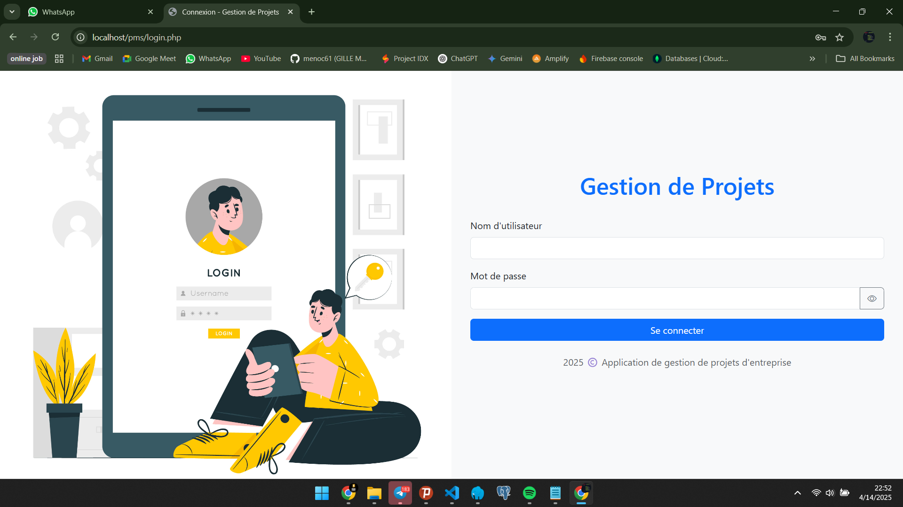
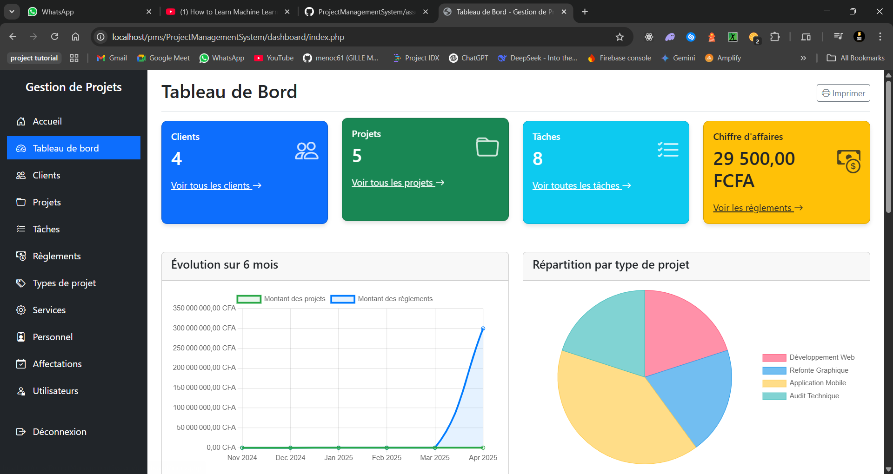

# Documentation de l'Application de Gestion de Projets d'Entreprise

## Introduction

Cette application de gestion de projets d'entreprise a été développée en PHP/MySQL procédural selon les spécifications fournies. Elle permet de gérer l'ensemble du cycle de vie des projets, depuis la création des clients jusqu'à la facturation et le suivi des règlements.

## Showcase de l'application

Voici quelques captures d'écran pour présenter l'application :

### Page de Connexion


### Tableau de Bord


Ces captures d'écran illustrent l'interface utilisateur et les fonctionnalités principales de l'application.

## Prérequis techniques

- Serveur web (Apache, Nginx, etc.)
- PHP 7.4 ou supérieur
- MySQL 5.7 ou supérieur
- Navigateur web moderne (Chrome, Firefox, Safari, Edge)

## Installation

1. Créez une base de données MySQL nommée `GestionProjetsEntreprise`
2. Importez le fichier `database.sql` pour créer les tables et insérer les données d'exemple
3. Configurez les paramètres de connexion à la base de données dans le fichier `config.php`
4. Placez tous les fichiers sur votre serveur web
5. Accédez à l'application via votre navigateur

## Structure de l'application

L'application est organisée de manière modulaire avec une structure de répertoires claire :

```
/
├── assets/              # Ressources statiques (CSS, JS, images)
├── clients/             # Module de gestion des clients
├── typesprojet/         # Module de gestion des types de projet
├── projets/             # Module de gestion des projets
├── taches/              # Module de gestion des tâches
├── reglements/          # Module de gestion des règlements
├── services/            # Module de gestion des services
├── personnel/           # Module de gestion du personnel
├── affectations/        # Module de gestion des affectations
├── utilisateurs/        # Module de gestion des utilisateurs
├── dashboard/           # Tableau de bord et statistiques
├── tests/               # Tests de l'application
├── config.php           # Configuration de la base de données
├── index.php            # Page d'accueil
├── login.php            # Page de connexion
└── logout.php           # Déconnexion
```

## Fonctionnalités principales

### Authentification et sécurité
- Système de connexion sécurisé avec hachage des mots de passe
- Gestion des rôles (administrateur et personnel)
- Protection des pages contre les accès non autorisés
- Gestion des sessions

### Module CLIENT
- Liste des clients avec recherche et filtres
- Création, modification et suppression de clients
- Vue détaillée avec historique des projets et règlements
- Export CSV et PDF

### Module TYPE DE PROJET
- Gestion des différents types de projets
- Configuration des forfaits et tarifs

### Module PROJET
- Liste des projets avec recherche et filtres multiples
- Création, modification et suppression de projets
- Vue détaillée avec onglets (tâches, finances, statistiques)
- Calcul automatique de la progression
- Export CSV et PDF

### Module TÂCHE
- Gestion des tâches liées aux projets
- Suivi des dates clés et des états
- Affectation du personnel

### Module RÈGLEMENT
- Saisie des paiements clients
- Suivi des règlements par projet
- Calcul automatique des soldes

### Module SERVICE
- Gestion des services de l'entreprise

### Module PERSONNEL
- Gestion des membres du personnel
- Suivi des affectations aux tâches

### Module AFFECTATION
- Attribution des tâches au personnel
- Suivi de la charge de travail

### Module UTILISATEUR
- Gestion des comptes utilisateurs
- Attribution des rôles

### Tableau de bord
- Statistiques globales
- Graphiques d'évolution
- Activités récentes
- Résumé financier

## Utilisateurs par défaut

L'application est livrée avec deux utilisateurs par défaut :

1. **Administrateur**
   - lOGIN : admin
   - Mot de passe : admin123

2. **Personnel**
   - lOGIN : carole
   - Mot de passe : carole123

## Responsive Design

L'application est entièrement responsive et s'adapte à tous les appareils :
- Ordinateurs de bureau
- Tablettes
- Smartphones

## Exports et impressions

Chaque module principal propose des fonctionnalités d'export :
- Export CSV pour l'analyse des données
- Export PDF pour l'impression et le partage
- Impression directe depuis le navigateur

## Tests et compatibilité

Une page de tests est disponible à `/tests/index.php` pour vérifier :
- La connexion à la base de données
- L'accès aux tables
- Le fonctionnement des sessions
- Les permissions selon les rôles
- La compatibilité navigateur
- La responsivité

## Support et maintenance

Cette application a été développée selon les meilleures pratiques de développement PHP procédural, avec un code clair et bien commenté pour faciliter la maintenance future.
